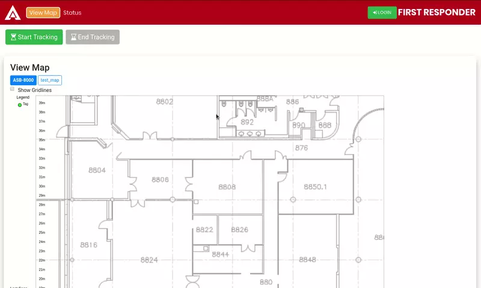

# Akriveia Beacon System

## Background
 
Over the last couple of decades’ urban centers around the world have faced substantial population growth. As a result, the number of larger and more complex commercial structures in core urban centers around the world is rapidly increasing. With a large population and massively complex buildings in relatively small areas, the potential impact of damages and casualties in the event of a disaster have greatly increased as well. Due to increased urbanization and complexity of urban structures, search and rescue operations in indoor urban environments face various complications and uncertainties. According to Statistics Canada, an average of 135 re related deaths occur each year from 2010 to 2014 [1].

A major concern during disaster search and rescue operations involving large and complex commercial buildings is the process of locating potentially trapped victims. In current conventions, there are no reliable methods of accurately locating trapped victims for first responders, as commercial building structures are large and complex by design. The Akriveia Beacon by TRIWAVE SYSTEMS focuses on creating an safe and dependable solution for indoor location tracking with the objective of locating multiple trapped victims in complex urban environments with pin point accuracy. Such system will allow search and rescue operations to be carried out during small scale disasters such as fires and low magnitude earthquakes safely and efficiently, minimizing potential damages and casualties.

Utilizing various hardware, electrical and software components, the engineers at TRIWAVE SYSTEMS is aiming to create a solution that can accurately and reliably to locate and identify trapped victims within complex structures in near real time. By pinpointing the exact coordinates of any trapped victims associated with an ID tag, the search and rescue time for first responders can be minimized, which is critical in any disaster rescue operations. This is achieved by incorporating a combination of advanced Decawave Ultra-wideband radio frequency (RF) modules, Espressif ESP32 microcontroller units (MCU), data processing units (DPU), and reliable trilateration techniques to create a dependable real time indoor location positioning system.

## UI DEMO

## References

- [1] Statistics-Canada. (2014, August) Interview on rust, a systems programming language developed by mozilla[online]. [Online]. Available: Availableat:https: //www150.statcan.gc.ca/n1/daily-quotidien/160916/dq160916c-eng.htm[Accessed8June.2019]
